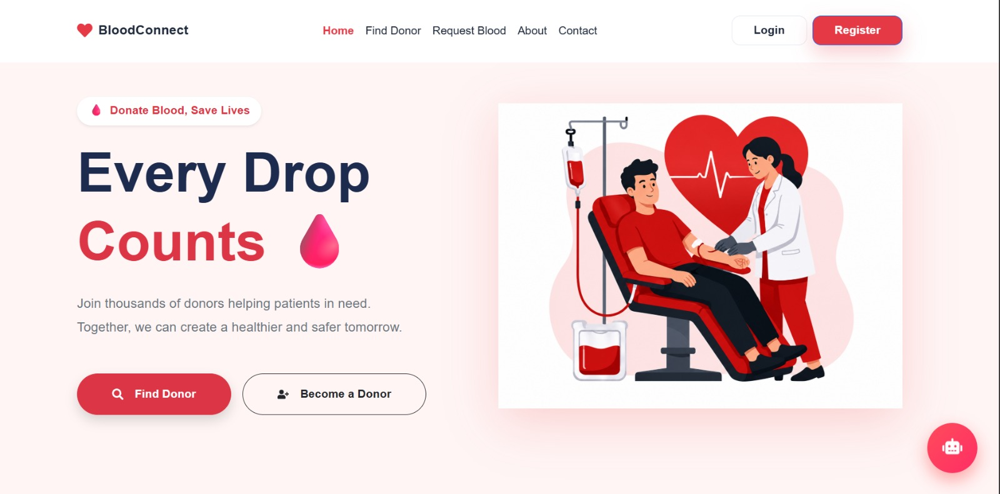
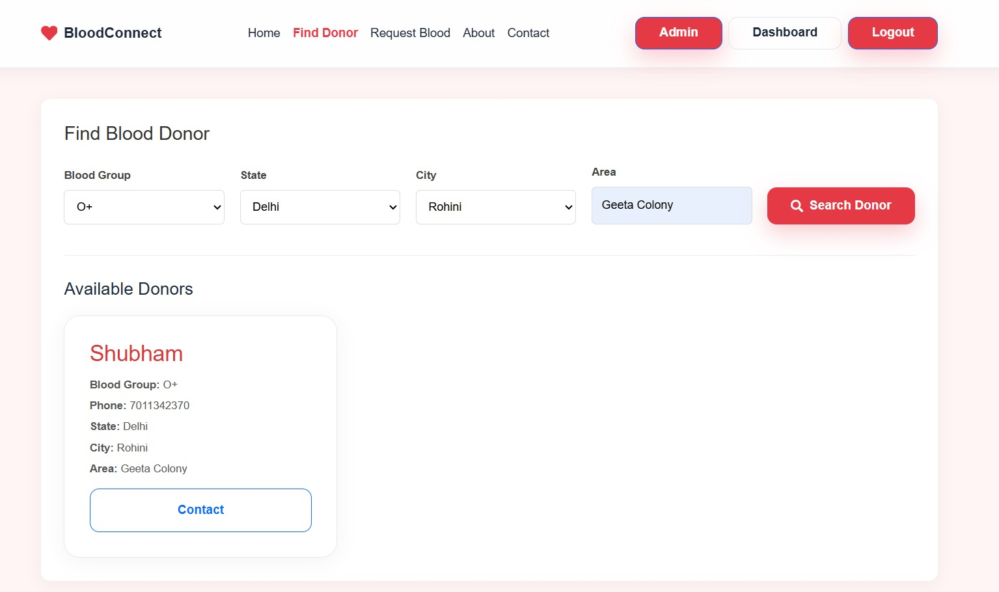
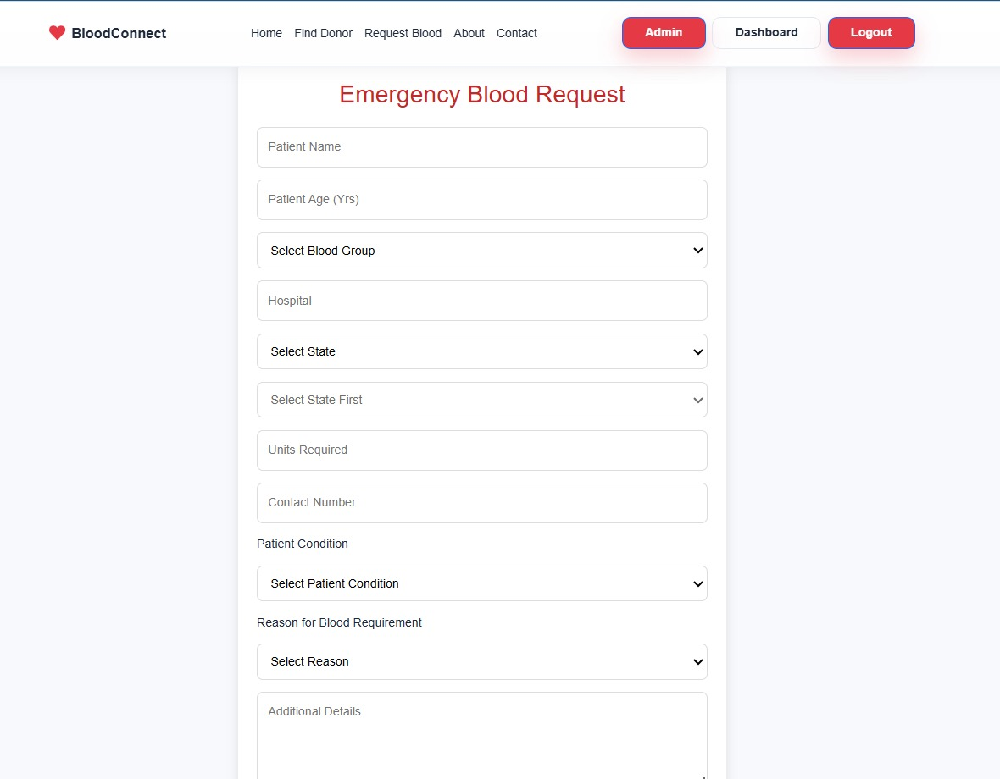
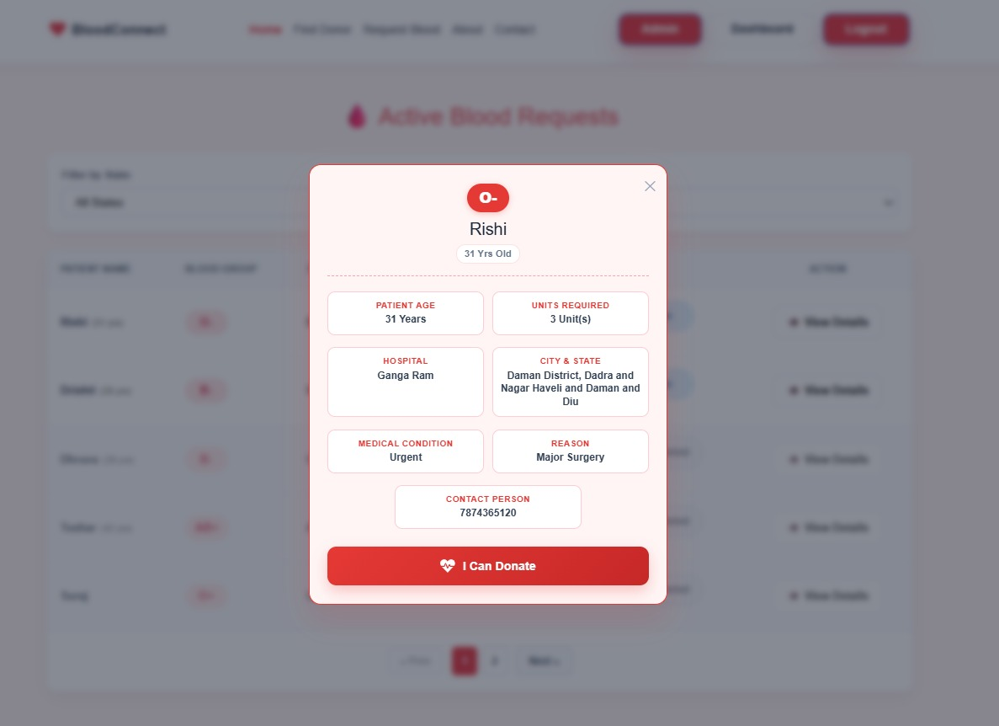
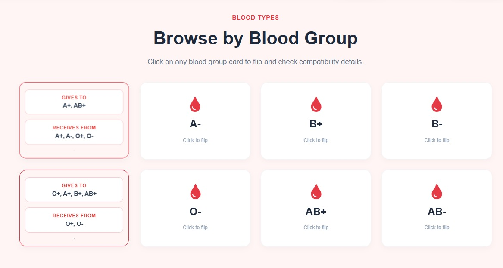
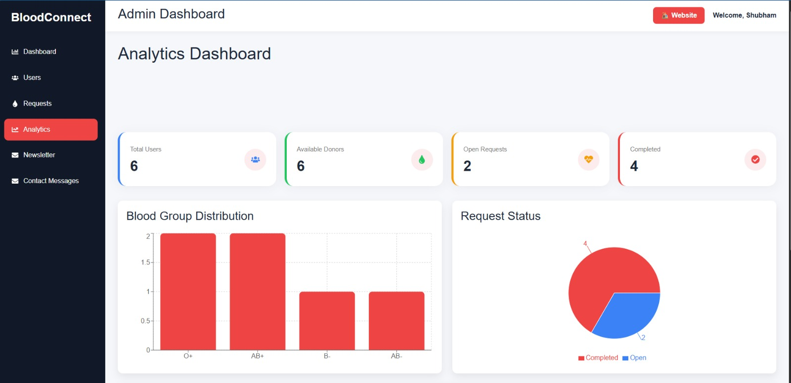
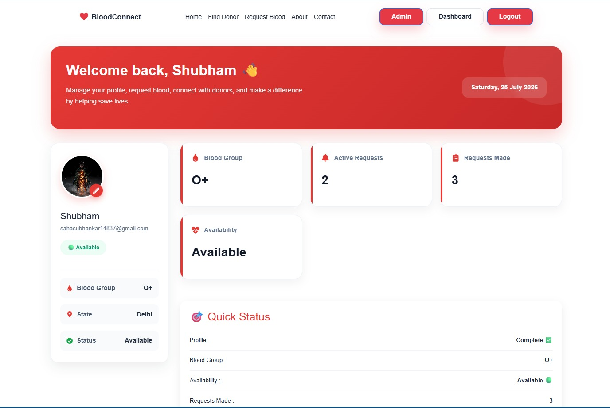
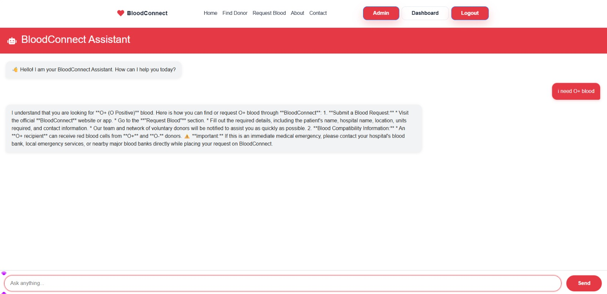

# 🩸 BloodConnect – AI-Powered Blood Donation Management System

<div align="center">


### Connecting Blood Donors & Patients Through Technology ❤️

*A secure, responsive MERN Stack web application that enables users to find blood donors, raise emergency blood requests, manage donations, and help save lives.*

[](https://blood-connect2.vercel.app/)

⭐ If you like this project, don't forget to give it a star!

</div>

---

# 🌐 Live Demo

🔗 **Explore the application live here:** [https://blood-connect2.vercel.app/](https://blood-connect2.vercel.app/)

---

# 📌 Overview

BloodConnect is a full-stack Blood Donation Management System built using the MERN Stack.

The platform connects blood donors with patients through an intuitive interface while providing an Admin Dashboard for managing users, blood requests, newsletters, contact messages, and analytics.

The project focuses on making emergency blood availability faster, easier, and more organized.

---

# ✨ Key Features

## 👤 User Module

- User Registration & Login
- JWT Authentication
- Password Encryption using bcrypt
- User Dashboard
- Profile Management
- Upload Profile Picture
- Blood Group Management
- Availability Status

---

## 🩸 Blood Donation Module

- Search Blood Donors
- Filter by

  - Blood Group
  - State
  - City
  - Area

- Contact Available Donors
- Blood Compatibility Cards
- Emergency Blood Requests
- Request Response System

---

## 🤖 AI BloodConnect Assistant

- AI-powered chatbot
- Blood compatibility guidance
- Donation assistance
- Blood request help
- General FAQs

---

## 🚨 Blood Request Module

Users can

- Create Blood Requests
- View Active Requests
- Respond to Requests
- Complete Requests
- Delete Requests
- View Donor Responses

Each request contains

- Patient Name
- Blood Group
- Hospital
- State
- City
- Area
- Units Required
- Contact Number
- Medical Condition
- Reason
- Additional Notes

---

## 👨‍💼 Admin Module

Admin Dashboard includes

- Dashboard Overview
- User Management
- Blood Request Management
- Analytics Dashboard
- Newsletter Management
- Contact Message Management

---

## 📊 Analytics

- Total Users
- Available Donors
- Open Requests
- Completed Requests
- Blood Group Distribution
- Request Status Charts

---

## 📧 Newsletter

Visitors can subscribe to newsletters.

Admin can

- View Subscribers
- Search Subscribers

---

## 📩 Contact System

Visitors can send messages directly.

Admin can view

- Name
- Email
- Subject
- Message
- Date

---

# 🎨 UI Highlights

- Modern Responsive Design
- Mobile Friendly
- Clean Dashboard UI
- Beautiful Cards
- Blood Compatibility Flip Cards
- Loading Animations
- Toast Notifications
- Framer Motion Animations
- AI Chat Interface
- Professional Admin Panel

---

# 🛠 Tech Stack

## Frontend

- React.js
- Vite
- React Router DOM
- Axios
- Framer Motion
- React Icons
- React Hot Toast
- CSS3

---

## Backend

- Node.js
- Express.js
- MongoDB
- Mongoose

---

## Authentication

- JWT
- bcryptjs

---

## Database Collections

- Users
- Requests
- Contacts
- Newsletters

---

# 📂 Project Structure

```text
BloodConnect
│
├── client
│   ├── src
│   │   ├── assets
│   │   ├── components
│   │   ├── hooks
│   │   ├── pages
│   │   ├── services
│   │   ├── utils
│   │   └── App.jsx
│
├── server
│   ├── config
│   ├── controllers
│   ├── middleware
│   ├── models
│   ├── routes
│   ├── utils
│   └── server.js
│
├── README.md
└── package.json
```

---

# 🔐 Authentication Flow

```text
User Login
      │
      ▼
JWT Token Generated
      │
      ▼
Stored in Local Storage
      │
      ▼
Authorization Header
      │
      ▼
Protected Routes
      │
      ▼
Backend Verification
```

---

# 📸 Project Screenshots

## 🏠 Home Page



---

## 🔍 Find Blood Donor



---

## 🚨 Blood Request Form



---

## 🩸 Active Blood Requests



---

## ❤️ Blood Compatibility Cards



---

## 📊 Admin Analytics Dashboard



---

## 👤 User Dashboard



---

## 🤖 AI BloodConnect Chatbot



---

# 🚀 Installation

## Clone Repository

```bash
git clone https://github.com/yourusername/BloodConnect.git
```

---

## Install Frontend

```bash
cd BloodConnect
npm install
npm install framer-motion
npm install react-icons
npm install vite
npm install react-icons
npm install react-hot-toast
npm install country-state-city
npm install recharts
npm install chart.js react-chartjs-2
npm run dev

```

---

## Install Backend

```bash
cd server
npm install axios
npm install openai
npm install dotenv
npm install @google/generative-ai
npm run dev
```

---

# ⚙ Environment Variables

Create a `.env` file inside the server folder.

```env
PORT=5000

MONGO_URI=your_mongodb_connection

JWT_SECRET=your_secret_key
```

---

# 📱 Responsive Design

Optimized for

- Desktop
- Laptop
- Tablet
- Mobile Devices

---

# 🔮 Future Enhancements

- Email Notifications
- OTP Verification
- Google Maps Integration
- SMS Notifications
- Push Notifications
- Blood Donation History
- AI Donor Recommendation
- Real-Time Chat
- Dark Mode
- Progressive Web App (PWA)

---

# 👨‍💻 Authors

### Frontend Development

**Anjali Jha**

- React.js
- UI/UX
- Dashboard Design
- Blood Compatibility Module
- AI Chatbot Interface

### Backend Development

**Subhankar Saha**

- Node.js
- Express.js
- MongoDB
- Authentication
- REST APIs

---

# ⭐ Support

If you found this project useful,

⭐ Star this repository

🍴 Fork it

💙 Contribute

---

# 📄 License

This project is developed for educational purposes under the MIT License.

---

<div align="center">

## ❤️ Every Drop Counts

Made with ❤️ using the MERN Stack

**BloodConnect — Saving Lives Through Technology**

</div>
